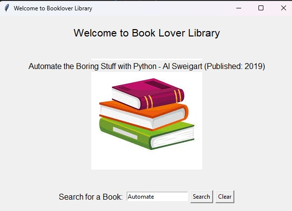
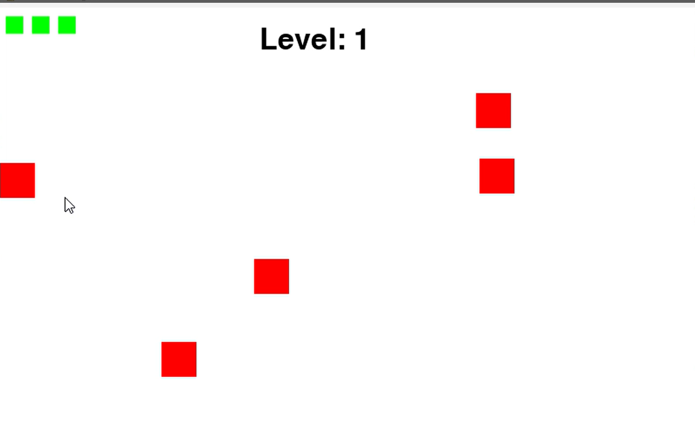
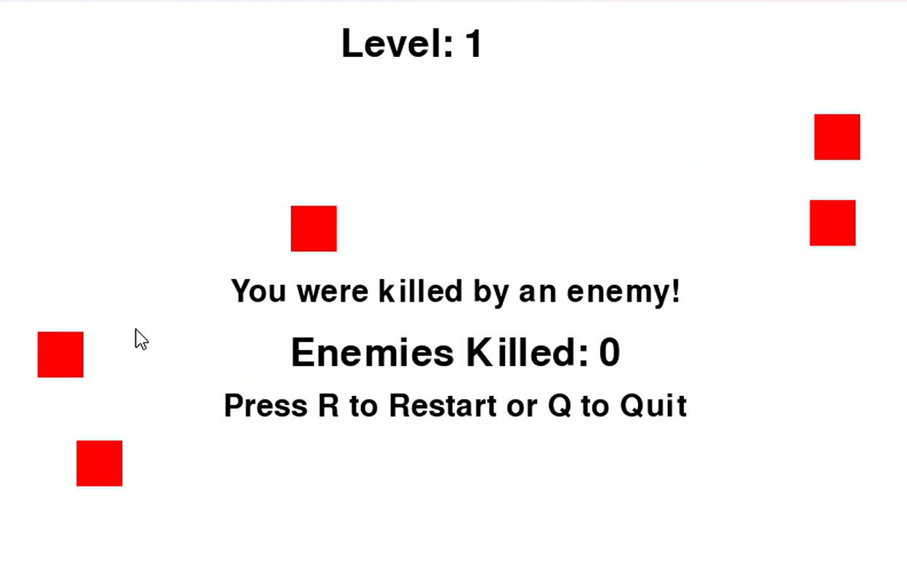

# Report: Assignment 3 

### Introduction
This report outlines the key tasks involved in the third assignment, which focuses on developing a Tkinter application using object-oriented programming concepts and creating a simple 2D side-scrolling game with Pygame. The assignment emphasizes the application of programming principles, teamwork through GitHub, and the development of functional software solutions.

### Question 1: Tkinter Application 

The development of the Book Lover Library, a library management system created using Python's Tkinter for the graphical user interface (GUI). The application allows users to search for books, showcasing various object-oriented programming (OOP) principles including encapsulation, multiple inheritance, decorators for logging, method overriding, and polymorphism. The project not only provides a functional library management system but also emphasizes best practices in programming. The application is ready for further enhancements, such as adding user authentication, book recommendations, and more complex search algorithms.

#### Key Features of the Application:

#### **Encapsulation**
The `BookDatabase` class encapsulates all book-related data, which includes a dictionary that holds information about each book, such as title, author, publication year, ISBN, and available copies. This design ensures that the book data is protected and can only be accessed through defined methods, promoting data integrity and security.

#### **Multiple Inheritance**
The application employs multiple inheritance by having the `LibraryManagementSystem` class inherit from both `tk.Tk` (for Tkinter functionality) and `BookDatabase` (for managing book data). This allows the GUI to directly access the book data and functionalities, creating a cohesive structure.

#### **Decorators for Logging**
A decorator called `log_method` is used to log method calls and handle errors gracefully. This ensures that any exceptions raised during method execution are caught and reported to the user through a message box, enhancing user experience and debugging.

#### **Method Overriding and Polymorphism**
The `AdvancedLibrarySystem` class demonstrates method overriding by extending the search functionality. This subclass can redefine the `search_by_title` method while still maintaining the functionality of the base class, showcasing polymorphism where different classes can have methods with the same name but different implementations.

#### User Interface Design
The GUI is designed to provide an intuitive user experience:

- **Welcome Label**: A greeting to users when they launch the application.
- **Search Field**: An input field where users can enter book titles to search.
- **Buttons**: A search button to trigger the search , add book and a clear button to reset the input.
- **Search Field**: When search book, it will show book details: Author and publication.
- **Add Book Field**: When Add book, it will show author name, date , copies etc.
- **Results Display**: A label to show the search results or messages to the user, ensuring that they are informed of their actions.

#### **Output: 

---

### Question 2: 2D Game Development with Pygame

This report details the development of a simple 2D side-scrolling game implemented using the Pygame library. The game features a player character that can run, jump, and shoot projectiles while navigating through three levels filled with enemies and collectibles. A scoring system based on defeated enemies and collected items, along with health management and lives, enhances the gameplay experience. Additionally, a game over screen allows players to restart or quit the game.
#### **Game Design**
The game is made up of several parts, including player controls, projectiles, enemies, items to collect, and three different levels.

#### **Player Class**
The player character can do the following:
- **Move**: Move left and right across the screen.
- **Jump**: Perform jumps to avoid obstacles or reach higher platforms.
- **Health & Lives**: The player has a health bar. If the health goes to zero, they lose a life. The game is over when all lives are lost.
- **Shoot**: The player can shoot to fight enemies.

#### **Projectile Class**
Projectiles are the bullets or objects that the player shoots.
- **Move**: Projectiles fly in a straight line.
- **Damage**: They damage enemies when they hit them.
- **Disappear**: They vanish when they hit an enemy or go off the screen.

#### **Enemy Class**
Enemies are the characters or objects that the player has to defeat. 
- **Move**: Enemies might walk, fly, or patrol an area.
- **Attack**: Some enemies might attack or damage the player if touched.
- **Health**: Each enemy has health. When it reaches zero, they disappear.
- **Boss Enemy**: The final level has a stronger enemy that is harder to defeat.

#### **Collectible Class**
Collectibles are items that help the player.
- **Heal**: Restore the player’s health.
- **Extra Life**: Give the player an additional life.

#### **Level Design**
The game has three levels that get harder as the player progresses. The levels include:
- **Level 1**: A simple start with easy enemies.
- **Level 2**: More difficult with more enemies and obstacles.
- **Level 3**: The final challenge with a boss fight at the end.

#### **Scoring System**
The player earns points for:
- **Defeating enemies**.
- **Collecting items**.
The score increases as the player progresses through the levels and defeats more enemies or finds more collectibles.

#### **Health Bar and Lives**
- **Player Health Bar**: Shows the player’s health, which decreases if they take damage.
- **Enemy Health Bar**: Shows how much health enemies have left.
- **Lives**: The player starts with a few lives. If they lose all lives, it’s game over.

### Steps:
1. **Installation**: Python and Pygame must be installed.
2. **Running the Game**: Download the files, navigate to the folder, and run `python main.py`.
3. **Gameplay Instructions**: Explains how to play, including movement, jumping, shooting, collecting items, and advancing levels.
4. **Video Demo**: A video demo [demo.mp4](https://github.com/Musrat-Jahan/HIT137_Assignment_3/raw/main/demo.mp4) is linked to show the gameplay.

#### **Output**
Output of this 2D side-scrolling game:

#### **Game Over Screen**
When the player loses all lives, a "Game Over" screen appears. The player can choose to restart the game and try again.

#### **Restart and Levels**
Players can restart the game from the beginning after losing. After beating a level, they move on to the next one.

This Pygame-based 2D side-scrolling game integrates several essential gaming mechanics, including player control, enemy interactions, scoring systems, and a game over mechanism. The modular design, with distinct classes for various game components, facilitates ease of maintenance and potential expansion, such as adding new levels, enemies, or power-ups. The game offers a foundation for further enhancements, including graphical improvements and additional gameplay features.

---
### Question 3: GitHub Repository Setup
The final task is to create a public GitHub repository for group collaboration:

### Create a Public GitHub Repository

- **Repository Name**: `HIT137_Assignment_3`
- **Visibility**: Public

### Add Group Members

- **Collaborators**: Add all group members to the repository as collaborators.
- **Permissions**: Ensure all members have appropriate permissions to push code, manage issues, and review pull requests.

#### Document Contributions
- **Description**: This repository contains code and documentation for Assignment 2, including text extraction, NLP tasks, image manipulation, and string manipulation.
- **Commits**: Use descriptive commit messages to document changes and updates.
- **Issues**: Track tasks and bugs using GitHub Issues. Assign issues to team members and provide clear descriptions.
- **Pull Requests**: Create pull requests for code reviews and merging changes. Include explanations of what changes are made and why.

#### Submission

- **Final Submission**: Provide the GitHub repository link (https://github.com/Musrat-Jahan/HIT137_Assignment_3.git))  as part of final submission. 
- **Documentation**: Ensure that all group members’ contributions are visible in the commit history and pull requests.
- **Code Review**: Make sure that the repository is well-documented, with clear comments and explanations for code changes.

# Conclusion
This report summarizes the key tasks of the third assignment, which involved creating a Tkinter application using object-oriented programming and developing a simple 2D side-scrolling game with Pygame. These projects allowed us to apply programming concepts, collaborate effectively using GitHub, and build functional software solutions. Overall, this assignment enhanced our coding skills and provided valuable experience in software development.
